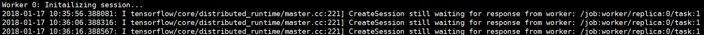
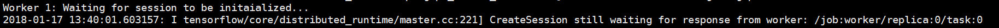

##  1.基本概念：

1. Cluster:  定义一个集群
2. Job:  定义一个Job
3. Task: 每个Job可以有多个task，一般一台机器上运行一个task

##  2.运行：

```
1.ps1 [10.240.209.96:8888]

python src/distributed.py --job_name='ps' --task_index=0

2.work1 [10.240.209.96:8888, docker]

CUDA_VISIBLE_DEVICES=0 \
python src/distributed.py --job_name='worker' --task_index=0 \
--worker_host='0.0.0.0:8888,0.0.0.0:9999' 

3.work2 [10.240.209.96:9999, docker]

CUDA_VISIBLE_DEVICES=1 \
python src/distributed.py --job_name='worker' --task_index=1 \ 
--worker_host='0.0.0.0:8888,0.0.0.0:9999' 
```

## 3.通信方式探究
### 3.1worker之间是如何通信的
```
	cluster_spec = {
		'ps': '10.240.209.96:8888', # 参数服务器
		'worker': '10.240.209.95:8888,10.240.209.95:9999' #两个worker，每一个有一个task
	}
```
```
	1. 实验1
	# 首先启动ps
	python src/distributed.py --job_name='ps' --task_index=0
	
	# 启动worker1
	CUDA_VISIBLE_DEVICES=0 \
	python src/distributed.py --job_name='worker' --task_index=0 \
    --worker_host='0.0.0.0:8888,0.0.0.0:9999' 

	#可以看到work1在等待work2(/job:worker/replica:0/task:1)，说明还是一个同步方式

	2. 实验2
	# 首先启动ps
	python src/distributed.py --job_name='ps' --task_index=0

	# 启动worker2
	CUDA_VISIBLE_DEVICES=1 \ 
	python src/distributed.py --job_name=worker --task_index=1 \ 
	--worker_host='0.0.0.0:8888,0.0.0.0:9999'
	
	#可以看到work2在work1(chief worker)没有初始化的情况下阻塞在prepare_or_wait_for_session等待worker1初始化session

	# 此时启动worker1
	CUDA_VISIBLE_DEVICES=0 \
	python src/distributed.py --job_name=worker  --task_index=0 \
    --worker_host='0.0.0.0:8888,0.0.0.0:9999'
    
	可以看到worker1和woker2同时开始训练， 训练完成之后worker2继续等待

	# 之所以在docker中采用worker_host='0.0.0.0:8888,0.0.0.0:9999'的方式，是为了使得worker1和worker2之间能够知道彼此的存在，能够通信，同步
```



